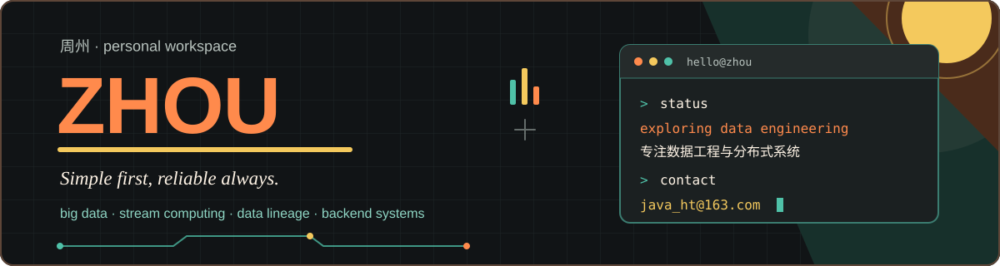

  

<picture>
  <source media="(prefers-color-scheme: dark)" srcset="./assets/header-contact.svg" />
  <source media="(prefers-color-scheme: light)" srcset="./assets/header-contact-light.svg" />
  
</picture>

  Have an idea worth talking about? Email me. 
  有想聊的点子或技术交流，欢迎来信。

  

<picture>
  <source media="(prefers-color-scheme: dark)" srcset="./assets/header-activity.svg" />
  <source media="(prefers-color-scheme: light)" srcset="./assets/header-activity-light.svg" />
  
</picture>

  

  <picture>
    <source media="(prefers-color-scheme: dark)" srcset="https://raw.githubusercontent.com/javaht/javaht/output/github-contribution-grid-snake-dark.svg" />
    <source media="(prefers-color-scheme: light)" srcset="https://raw.githubusercontent.com/javaht/javaht/output/github-contribution-grid-snake.svg" />
    
  </picture>

  <em>所知甚少，所学甚微 · Keep exploring.</em>

